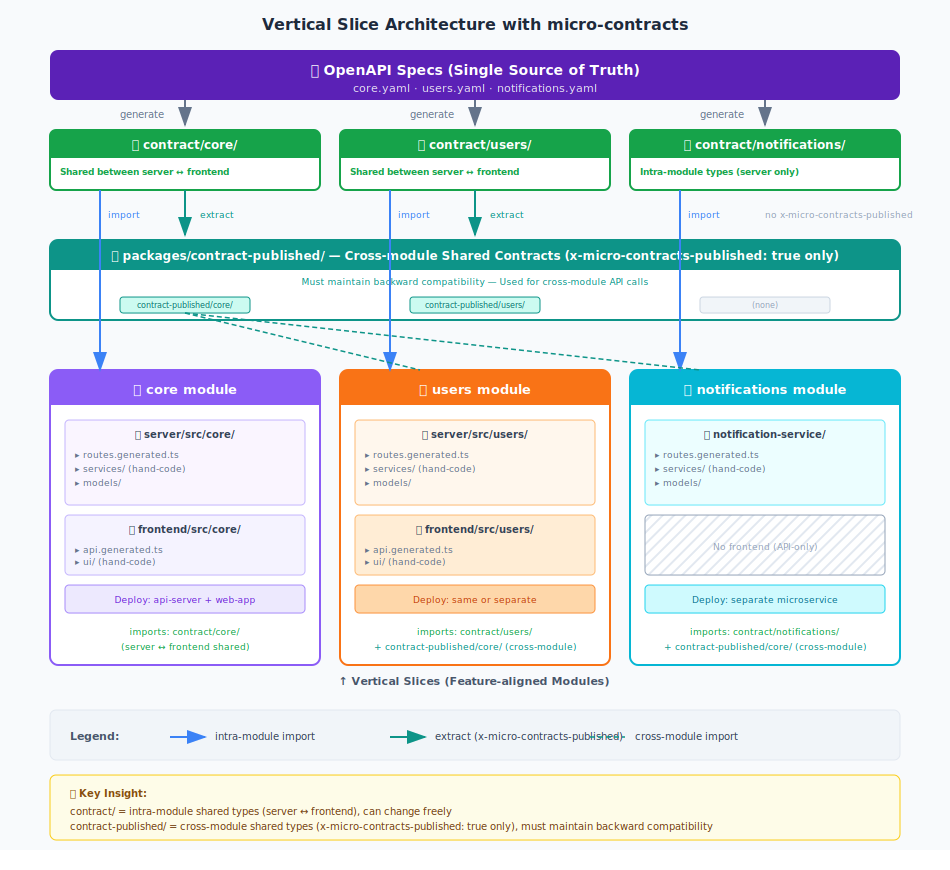

# micro-contracts

[](https://www.npmjs.com/package/micro-contracts) [](https://opensource.org/licenses/MIT) [](https://nodejs.org/) [](https://www.typescriptlang.org/) [](https://www.openapis.org/)

**Contract-first vertical slices for TypeScript Web/API systems.**

micro-contracts is a contract-first toolchain for TypeScript Web/API development. It tackles common failure modes—**frontend/backend contract drift**, **duplicated "common" rules**, and **accidental breaking changes in public APIs**—by treating **OpenAPI as the Single Source of Truth (SSoT)**.

Contracts alone aren't enough—they must be **enforceable**. micro-contracts includes **[Enforceable Guardrails](docs/development-guardrails.md)** that prevent both humans and AI from bypassing the contract-first workflow: blocking direct edits to generated files, detecting drift, and verifying security declarations match implementations.

## Design Philosophy



The core architecture is organized along two axes:

| Axis | Description | Example |
|------|-------------|---------|
| **Vertical (feature-aligned slices)** | A *module* is a feature-aligned contract boundary. The same contract spans UI (frontend) and API (backend). | `core`, `billing`, `users` |
| **Horizontal (cross-cutting concerns)** | Auth, tenancy, rate limiting, and shared error behavior are applied consistently via **OpenAPI Overlays**. | `x-middleware: [requireAuth, tenantIsolation]` |

### Key Differentiators

| # | Differentiator | What it means |
|---|----------------|---------------|
| 1 | **Vertical Modules + Horizontal Overlays** | Feature-aligned modules as contract boundaries; cross-cutting concerns (auth, rate-limit) injected via [OpenAPI Overlays](https://www.openapis.org/blog/2024/10/22/announcing-overlay-specification). |
| 2 | **OpenAPI as SSoT → Multi-artifact generation** | Single spec generates contract packages, server routes, and frontend clients. No manual sync required. |
| 3 | **Enforceable Guardrails** | Built-in checks prevent bypassing contract-first workflow—blocks direct edits to generated files, detects drift, verifies security declarations. See **[Guardrails](docs/development-guardrails.md)**. |
| 4 | **Public Surface Governance** | `contract-published` is extracted (not duplicated) from the master contract. `x-micro-contracts-non-exportable` fails generation if internal data leaks. |
| 5 | **Explicit Module Dependencies** | `x-micro-contracts-depend-on` declares cross-module dependencies. `deps/` re-exports only declared types; enables impact analysis. |

---

## Who is this for?

| Scenario | Why micro-contracts helps |
|----------|---------------------------|
| **Modular monolith → microservices** | Same contracts work in monolith or split services; dependency tracking prevents hidden coupling |
| **Multiple teams sharing OpenAPI** | Explicit module dependencies make cross-team impact visible |
| **Published API with compatibility SLA** | `contract-published` extraction + `x-micro-contracts-non-exportable` fail-fast prevents accidental exposure |
| **Cross-cutting concerns at scale** | OpenAPI Overlays inject auth/rate-limit/tenancy without copy-paste |

**Not the best fit for:** Single-developer projects, auto-generated UI from schema, multi-language SDK generation (use OpenAPI Generator instead).

---

## Quick Start

> **Prerequisites**: Node.js 18+, TypeScript 5.0+, ESM (`"type": "module"`).

```bash
# 1. Install
npm install --save-dev micro-contracts

# 2. Initialize module structure
npx micro-contracts init core --openapi path/to/your/spec.yaml

# 3. Generate all code
npx micro-contracts generate
```

```typescript
// 4. Use in your server
import { registerRoutes } from './core/routes.generated.js';
await registerRoutes(fastify);
```

> **What `init` creates**: The `init` command creates starter templates for **Fastify** (server) and **fetch API** (client).
> These are scaffolds to get you started — modify them for your framework (Express, Hono, Axios, etc.) or add new output types.
>
> **📦 Full working example**: See [`examples/`](./examples/) for a complete project with multiple modules, overlays, and cross-module dependencies.

---

## Core Concepts

### OpenAPI as Single Source of Truth (SSoT)

```
OpenAPI spec (spec/{module}/openapi/*.yaml)
    ↓ micro-contracts generate
Contract packages (packages/contract/{module}/)
    ├── schemas/types.ts       # Request/Response types
    ├── domains/               # Domain interfaces
    └── overlays/              # Overlay handler interfaces
    ↓
Server routes + Frontend clients (generated via templates)
```

### Modules vs Services

| Concept | Definition | Example |
|---------|------------|---------|
| **Module** | Logical contract boundary (OpenAPI + Domain) | `core`, `billing`, `users` |
| **Service** | Deployment unit (can contain 1+ modules) | `api-server` |

A monolith may have multiple modules in one service. Start with multiple modules in one service and split later as needed.

### Contract Packages

| Package | Description | Compatibility Policy |
|---------|-------------|---------------------|
| `contract` | Master contract (all APIs) | Internal APIs can change freely |
| `contract-published` | Public APIs only (`x-micro-contracts-published: true`) | Must maintain backward compatibility |

**Key insight**: `contract-published` is **extracted from** `contract` (not generated separately). This ensures a single SSoT.

### Cross-cutting Concerns with Overlays

1. Mark operations with `x-middleware` (or custom extensions) in OpenAPI
2. Define overlay that adds params/responses when extension is present
3. Generator applies overlays and produces `openapi.generated.yaml`
4. Generate code from the result

> **📖 Deep Dive**: See **[OpenAPI Overlays (Deep Dive)](docs/overlays-deep-dive.md)** for complete examples and configuration.

---

## Directory Structure

```
project/
├── spec/                              # ✅ Human-edited (contract source of truth)
│   ├── spectral.yaml                  #    Global lint rules
│   ├── default/templates/             #    Handlebars templates (customizable)
│   ├── _shared/
│   │   ├── openapi/                   #    Shared schemas (ProblemDetails, etc.)
│   │   └── overlays/                  #    Cross-module overlays
│   └── {module}/
│       ├── openapi/{module}.yaml      #    OpenAPI spec
│       └── overlays/                  #    Module-specific overlays
│
├── packages/                          # ❌ Auto-generated (DO NOT EDIT)
│   ├── contract/{module}/
│   │   ├── schemas/                   #    Types, validators
│   │   ├── domains/                   #    Domain interfaces
│   │   ├── overlays/                  #    Overlay handler interfaces
│   │   └── deps/                      #    Re-exports from dependencies
│   └── contract-published/{module}/   #    Public API subset
│
├── server/src/{module}/
│   ├── routes.generated.ts            # ❌ Auto-generated (template: fastify-routes.hbs)
│   ├── domains/                       # ✅ Human-edited (domain implementations)
│   └── overlays/                      # ✅ Human-edited (overlay implementations)
│
└── frontend/src/{module}/
    └── api.generated.ts               # ❌ Auto-generated (template: fetch-client.hbs)
```

> **Note**: `*.generated.ts` files are generated from Handlebars templates in `spec/default/templates/`.
> You can customize or replace templates for different frameworks (Express, Hono, Axios, etc.).
>
> **Why commit generated files?** Generated artifacts are committed to enable code review of contract changes and CI drift detection. If spec changes but generated code doesn't match, CI fails.

---

## OpenAPI Extensions

### Required Extensions

| Extension | Type | Description |
|-----------|------|-------------|
| `x-micro-contracts-domain` | string | Domain class name (e.g., `User`, `Order`) |
| `x-micro-contracts-method` | string | Method name to call (should match `operationId`) |

### Optional Extensions

| Extension | Type | Description |
|-----------|------|-------------|
| `x-micro-contracts-published` | boolean | Include in `contract-published` (compatibility SLA) |
| `x-micro-contracts-non-exportable` | boolean | Mark as non-exportable (fails if used in published endpoints) |
| `x-micro-contracts-depend-on` | string[] | Explicit dependencies on other modules' published APIs |

### Example

```yaml
paths:
  /api/users:
    get:
      operationId: getUsers
      x-micro-contracts-domain: User
      x-micro-contracts-method: getUsers
      x-micro-contracts-published: true
      x-middleware: [requireAuth]            # Custom extension for overlays
      responses:
        '200':
          description: Success
          content:
            application/json:
              schema:
                $ref: '#/components/schemas/UserListResponse'
```

### Module Dependencies

Declare dependencies with `x-micro-contracts-depend-on`:

```yaml
# spec/billing/openapi/billing.yaml
info:
  x-micro-contracts-depend-on:
    - core.User.getUsers
    - core.User.getUserById
```

Import via generated `deps/`:

```typescript
// ✅ Recommended: Import from deps/
import type { User } from '@project/contract/billing/deps/core';

// ❌ Avoid: Direct contract-published import
import type { User } from '@project/contract-published/core/schemas';
```

---

## Configuration

Create `micro-contracts.config.yaml`:

```yaml
defaults:
  contract:
    output: packages/contract/{module}
  contractPublic:
    output: packages/contract-published/{module}
  outputs:
    server-routes:
      output: server/src/{module}/routes.generated.ts
      template: spec/default/templates/fastify-routes.hbs
    frontend-api:
      output: frontend/src/{module}/api.generated.ts
      template: spec/default/templates/fetch-client.hbs
  overlays:
    shared:
      - spec/_shared/overlays/middleware.overlay.yaml

modules:
  core:
    openapi: openapi/core.yaml
  billing:
    openapi: openapi/billing.yaml
    dependsOn:
      - core.User.getUsers
```

---

## CLI Reference

```bash
micro-contracts <command> [options]

Commands:
  init <module>   Initialize a new module structure
  generate        Generate code from OpenAPI specifications
  lint            Lint OpenAPI specifications (Spectral)
  check           Run guardrail checks
  deps            Analyze module dependencies
```

### generate

```bash
micro-contracts generate [options]

Options:
  -m, --module <names>    Module names, comma-separated (default: all)
  --contracts-only        Generate contract packages only
  --server-only           Generate server routes only
  --frontend-only         Generate frontend clients only
```

### lint

```bash
micro-contracts lint [options]

Options:
  -m, --module <names>    Module names (default: all)
  --strict                Treat warnings as errors
```

### deps

```bash
micro-contracts deps [options]

Options:
  --graph                 Display dependency graph
  --who-depends-on <api>  Find modules that depend on specific API
  --impact <api>          Analyze impact of changing specific API
```

---

## Generated Code

### Domain Interface

```typescript
// packages/contract/core/domains/UserDomainApi.ts
export interface UserDomainApi {
  getUsers(input: UserDomain_getUsersInput): Promise<UserListResponse>;
  getUserById(input: UserDomain_getUserByIdInput): Promise<User>;
}
```

### Domain Implementation

```typescript
// server/src/core/domains/UserDomain.ts
import type { UserDomainApi } from '@project/contract/core/domains/UserDomainApi.js';

export class UserDomain implements UserDomainApi {
  async getUsers(input) {
    // Input is HTTP-agnostic: { limit?: number, offset?: number }
    return { users: [...], total: 100 };
  }
}
```

---

## Related Documentation

| Document | Description |
|----------|-------------|
| **[Examples](./examples/)** | Complete working project with multiple modules, overlays, and cross-module dependencies |
| **[OpenAPI Overlays (Deep Dive)](docs/overlays-deep-dive.md)** | Complete overlay examples, JSONPath patterns, template context |
| **[Enforceable Guardrails (AI-ready)](docs/development-guardrails.md)** | CI integration, security checks, allowlist configuration |

---

## Comparison with Similar Tools

| Aspect | micro-contracts | OpenAPI Generator | ts-rest |
|--------|-----------------|-------------------|---------|
| **Primary focus** | Contract governance (server + frontend + CI) | Multi-language SDK generation | TypeScript-first contract |
| **SSoT** | OpenAPI | OpenAPI | TypeScript |
| **Multi-artifact generation** | ✅ contract + routes + clients | △ SDK-focused (different goal) | ✅ Strong client/server alignment |
| **Enforceable guardrails** | ✅ Built-in (drift, no direct edit, CI gates) | ❌ Requires separate design | ❌ Requires separate design |
| **Public API governance** | ✅ `contract-published` + fail-fast | ❌ Manual | ❌ N/A |
| **Module dependencies** | ✅ `x-micro-contracts-depend-on` + `deps/` | ❌ Manual | ❌ Manual |
| **Cross-cutting concerns** | ✅ OpenAPI Overlays | ❌ Manual | △ Code-level implementation |


---

## License

MIT
