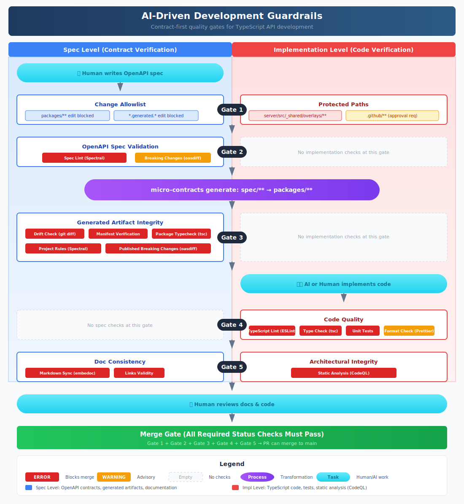

# Development Guardrails (AI-ready)

This document defines **guardrails for AI-assisted and human development**. The guardrails are designed to prevent "diff explosion", keep contracts authoritative, and make changes **machine-verifiable**.

The key idea is to separate the system into two layers:

- **Tooling (shipped as code / reusable)**: deterministic checks and generators that run locally and in CI and return a clear pass/fail.
- **Operations (configured in CI / repo policy)**: GitHub configuration (workflows, branch protection, rulesets, approvals) that **enforces** the tooling and protects the guardrails themselves.

> The guardrails must not depend on *who* wrote the change (human/AI). They depend only on *what* changed and whether it satisfies the contract.

---

## Table of Contents

1. [Gate Overview](#gate-overview)
2. [Available Checks](#available-checks)
3. [Configuration](#configuration)
4. [Operations (CI / Repo Policy)](#operations-ci--repo-policy)
5. [Developer Workflow](#developer-workflow)
6. [Appendix: CI Configuration](#appendix-ci-configuration)

---

## Gate Overview

The following diagram illustrates the overall architecture of the guardrails system:



### Gate Summary

| Gate | Name | Scope | What it prevents |
|------|------|-------|------------------|
| **1** | Change Allowlist | repo-wide | Editing protected/generated areas directly |
| **2** | OpenAPI Spec Validation | `spec/**` | Invalid specs, bad extensions, breaking changes |
| **3** | Generated Artifact Integrity | `packages/**`, `*.generated.*` | Hand-editing generated code, drift, tampering |
| **4** | Code Quality | `server/**`, `frontend/**` | Type errors, lint issues, failing tests |
| **5** | Doc & Architectural Consistency | `docs/**`, all code | Doc/code mismatch, broken references, architecture drift |

---

## Available Checks

Checks are divided into two categories:

- **Built-in**: Core checks implemented in `micro-contracts` CLI (allowlist, drift, manifest)
- **Custom**: User-defined commands in `micro-contracts.guardrails.yaml` (`checks:` section)

### Check Command Options

```bash
micro-contracts check [options]

Options:
  --only <checks>             Run only specific checks (comma-separated)
  --skip <checks>             Skip specific checks (comma-separated)
  --gate <gates>              Run checks for specific gates only (comma-separated, 1-5)
  -v, --verbose               Enable verbose output (groups by gate)
  --fix                       Auto-fix issues where possible
  -g, --guardrails <path>     Path to guardrails.yaml
  -d, --generated-dir <path>  Path to generated files directory (default: "packages/")
  --changed-files <path>      Path to file containing list of changed files (for CI)
  --list                      List available checks with gate assignments
  --list-gates                List available gates
```

**Examples:**

```bash
# Run all checks
micro-contracts check

# Run only Gate 1 and 2 checks
micro-contracts check --gate 1,2

# Run Gate 3 checks with verbose output (grouped by gate)
micro-contracts check --gate 3 -v

# Run specific checks by name
micro-contracts check --only allowlist,drift

# List all checks with their gate assignments
micro-contracts check --list

# List available gates
micro-contracts check --list-gates
```

### Gate 1: Change Allowlist

Prevents unauthorized edits to protected/generated areas.

| Check | Type | Description | Local Command | CI Job |
|-------|------|-------------|---------------|--------|
| Allowlist | built-in | Block **direct** edits to `packages/**`, `*.generated.*`; require approval for `.github/**` | `micro-contracts check --only allowlist` | `allowlist` |

Files are categorized into three groups:

| Category | Examples | Who can edit |
|----------|----------|--------------|
| `allowed` | `spec/**/*.yaml`, `server/src/**/domains/**` | Anyone (AI or human) |
| `protected` | `.github/**`, `spec/spectral.yaml`, `server/src/_shared/overlays/**` | Requires CODEOWNERS approval |
| `generated` | `packages/**`, `*.generated.*` | Only via `generate` command |

Protected files include:
- CI/workflow definitions (`.github/**`) — guardrail bypass prevention
- Spectral lint rules (`spec/spectral.yaml`) — security rule tampering
- Shared overlay implementations (`server/src/_shared/overlays/**`) — security logic

### Gate 2: OpenAPI Spec Validation

Validates OpenAPI specs before generation.

| Check | Type | Description | Local Command | CI Job |
|-------|------|-------------|---------------|--------|
| Spec lint | custom | OpenAPI schema + micro-contracts extensions (Spectral) | `micro-contracts check --only spec-lint` | `spec-lint` |
| Breaking changes | custom | API compatibility check (oasdiff) | `micro-contracts check --only spec-breaking` | `spec-breaking` |

**Spec lint** — Validates via Spectral ruleset:
- OpenAPI 3.x structure (required fields, JSON Schema, `$ref` resolution)
- micro-contracts extensions (`x-micro-contracts-domain`, `x-micro-contracts-method`)
- Security extensions (`x-auth`, `x-authz`) if required

**Breaking changes** — Detects backward-incompatible changes:
- Removed endpoints or parameters
- Changed response schemas
- Modified required fields

### Generator

Transforms `spec/**` → `packages/**`.

| Command | Description |
|---------|-------------|
| `micro-contracts generate` | Generate contracts from OpenAPI specs |

> **Note**: When `micro-contracts.guardrails.yaml` has a `generated:` section defined, `generate` automatically creates/updates `packages/.generated-manifest.json`. Use `--no-manifest` to skip this behavior.

### Gate 3: Generated Artifact Integrity

Ensures generated code matches spec and hasn't been tampered.

> **Why commit generated artifacts?** CI re-runs `generate` and compares against committed files to detect tampering or drift. Without committed artifacts, there's no baseline to verify.

| Check | Type | Description | Local Command | CI Job |
|-------|------|-------------|---------------|--------|
| Drift | built-in | `git diff packages/` must be clean | `micro-contracts check --only drift` | `drift` |
| Manifest | built-in | SHA-256 hash verification | `micro-contracts check --only manifest` | `manifest` |
| Package typecheck | custom | Generated packages compile (`tsc`) | `micro-contracts check --only package-typecheck` | `package-typecheck` |
| Project rules | custom | Project-specific Spectral rules on **generated** spec | `micro-contracts check --only spec-project` | `spec-project` |
| Published breaking | custom | Breaking changes vs **published** contract (oasdiff) | `micro-contracts check --only spec-breaking-published` | `spec-breaking-published` |

> **Why spec checks in Gate 3?** `spec-project` and `spec-breaking-published` validate the **generated/bundled** spec output, not the source. They run after generation to verify the published contract.

**Drift check** — After running `generate`, `packages/**` must match committed state:
```bash
git diff --exit-code packages/
```

**Manifest verification** — `packages/.generated-manifest.json` stores:
- SHA-256 hashes of all generated files
- Generator version used
- Source spec file references

**Package typecheck** — Generated TypeScript must compile without errors.

### Gate 4: Code Quality

Validates implementation code quality.

| Check | Type | Description | Local Command | CI Job |
|-------|------|-------------|---------------|--------|
| TypeScript lint | custom | ESLint rules | `micro-contracts check --only code-lint` | `code-lint` |
| Type check | custom | TypeScript compilation (`tsc --noEmit`) | `micro-contracts check --only code-typecheck` | `code-typecheck` |
| Unit tests | custom | Test suite execution | `micro-contracts check --only code-test` | `code-test` |
| Format check | custom | Prettier formatting | `micro-contracts check --only code-format` | `code-format` |

### Gate 5: Doc & Architectural Consistency

Ensures documentation and architecture stay in sync.

| Check | Type | Description | Local Command | CI Job |
|-------|------|-------------|---------------|--------|
| Markdown sync | custom | Code snippets in docs (embedoc) | `micro-contracts check --only docs-sync` | `docs-sync` |
| Links validity | custom | Broken link detection | `micro-contracts check --only docs-links` | `docs-links` |
| Architectural integrity | external | Static analysis (CodeQL) | GitHub CodeQL Action | `codeql` |

**Architectural integrity (CodeQL)** — Static analysis verifies:
- HTTP entry points reach security overlays
- Transaction boundaries are respected
- Domain symbols resolve correctly
- No direct HTTP calls outside generated client

---

## Configuration

### micro-contracts.guardrails.yaml

<!--@embedoc:code_snippet file="../examples/micro-contracts.guardrails.yaml" lang="yaml" title="micro-contracts.guardrails.yaml (example)"-->
**micro-contracts.guardrails.yaml (example)**

```yaml
# AI-Driven Development Guardrails Configuration
# 
# This file defines which files can be modified in normal development PRs.
# Patterns use gitignore-style matching with glob patterns.
# Prefix with ! to negate (exclude) a pattern.

# Files that can be edited in normal development PRs
allowed:
  # OpenAPI specs (source of truth)
  - spec/**/openapi/*.yaml
  - spec/**/templates/*.hbs
  
  # Domain implementations (human-written)
  - server/src/**/domains/**/*.ts
  - server/src/**/container.ts
  - server/src/server.ts
  
  # Module-specific overlays (NOT _shared)
  - server/src/*/overlays/**/*.ts
  - "!server/src/_shared/overlays/**"
  
  # Configuration
  - micro-contracts.config.yaml
  - package.json
  - tsconfig.json
  
  # Documentation
  - docs/**/*.md
  - README.md

# Files that require special approval
protected:
  # Spectral lint rules
  - spec/spectral.yaml
  - spec/_shared/spectral.yaml
  
  # Shared overlay definitions
  - spec/_shared/overlays/**
  
  # Shared security overlay implementations
  - server/src/_shared/overlays/**
  
  # This guardrails configuration
  - micro-contracts.guardrails.yaml
  
  # CI/workflow definitions
  - .github/**

# Generated artifacts (committed, but only modified via generate)
generated:
  # Contract packages
  - packages/**
  
  # Generated files
  - "**/*.generated.ts"
  - "**/*.generated.yaml"
  - "**/*.generated.yml"

# Check command configurations
# Define custom commands for each guardrail check
#
# Based on guardrails-concept.svg:
#
# Gate 1: Change Allowlist
#   - allowlist (built-in): packages/** edit blocked, *.generated.* edit blocked
#
# Gate 2: OpenAPI Contract Validation (Spectral)
#   - spec-lint: Schema Validity, x-security Required, x-auth Declaration
#   - spec-breaking: Breaking Changes detection (oasdiff)
#
# Gate 3: Generated Artifact Integrity
#   - drift (built-in): git diff packages/**
#   - manifest (built-in): SHA-256 verification
#   - package-typecheck: Generated package type check
#
# Gate 4: Code Quality
#   - code-lint: TypeScript Lint (ESLint)
#   - code-typecheck: Type Check (tsc)
#   - code-test: Unit Tests
#
# Gate 5: Doc Consistency & Static Analysis
#   - docs-sync: Markdown Sync (embedoc)
#   - docs-links: Links Valid
#   - security (built-in): CodeQL static analysis
#
# Placeholders:
#   {files} - space-separated list of target files (auto-detected)
#   {cwd} - current working directory

checks:
  # ==========================================
  # Gate 2: OpenAPI Contract Validation
  # ==========================================
  # Schema Validity, x-security Required, x-auth Declaration, Description Check
  spec-lint:
    command: "npx @stoplight/spectral-cli lint {files} --ruleset spec/spectral.yaml"
    gate: 2
  
  # Breaking Changes detection (oasdiff)
  # Compare current spec against main branch
  # Uses bundled spec to resolve $refs properly
  #
  # NOTE: Replace the base path with your actual generated spec location:
  #   Recommended: main:packages/contract/<module>/docs/openapi.generated.yaml
  #   Example below uses: main:examples/packages/... (for this repo's structure)
  spec-breaking:
    command: "bash -c 'npx @redocly/cli bundle spec/core/openapi/core.yaml -o /tmp/current.yaml && git show main:examples/packages/contract/core/docs/openapi.generated.yaml > /tmp/base.yaml 2>/dev/null && oasdiff breaking /tmp/base.yaml /tmp/current.yaml --fail-on ERR || echo \"No base spec found (new file)\"'"
    gate: 2

  # ==========================================
  # Gate 3: Generated Artifact Integrity
  # ==========================================
  # drift, manifest are built-in checks (gate: 3)
  
  # Generated package type check
  package-typecheck:
    command: "cd packages/contract && npx tsc --noEmit"
    gate: 3

  # ==========================================
  # Gate 4: Code Quality
  # ==========================================
  # TypeScript Lint (ESLint)
  code-lint:
    command: "cd server && npx eslint src/ --ext .ts && cd ../frontend && npx eslint src/ --ext .ts,.tsx"
    gate: 4
  
  # Type Check (tsc)
  code-typecheck:
    command: "cd server && npx tsc --noEmit && cd ../frontend && npx tsc --noEmit"
    gate: 4
  
  # Unit Tests
  code-test:
    command: "cd server && npm test && cd ../frontend && npm test"
    gate: 4
    enabled: false  # Enable when tests are set up

  # ==========================================
  # Gate 5: Doc Consistency & Static Analysis
  # ==========================================
  # Markdown Sync (embedoc) - regenerate and check for drift
  docs-sync:
    command: "npx embedoc build && git diff --exit-code docs/"
    gate: 5
    enabled: false  # Enable when docs/ directory exists
  
  # Links Valid - verify documentation references
  docs-links:
    command: "node scripts/verify-doc-consistency.mjs"
    gate: 5
    enabled: false  # Enable when scripts/verify-doc-consistency.mjs exists
  
```

📄 Source: [`micro-contracts.guardrails.yaml`](../examples/micro-contracts.guardrails.yaml) (lines full)
<!--@embedoc:end-->

### Manifest Format

When guardrails are configured with a `generated:` section, `micro-contracts generate` automatically creates `packages/.generated-manifest.json`:

```json
{
  "version": "1.0.0",
  "generatedAt": "2024-01-15T10:30:00Z",
  "generatorVersion": "1.2.3",
  "files": {
    "contract/core/schemas/types.ts": {
      "sha256": "a1b2c3d4e5f6...",
      "source": "spec/core/openapi/core.yaml"
    }
  }
}
```

---

## Operations (CI / Repo Policy)

### Pinned Generator (Supply Chain Boundary)

CI must run the generator via **pinned `npx`** to prevent local tampering:

```bash
npx --yes -p micro-contracts@${MICRO_CONTRACTS_VERSION} micro-contracts generate
npx --yes -p micro-contracts@${MICRO_CONTRACTS_VERSION} micro-contracts check
```

### Protecting `.github/**`

- Feature branches MUST NOT modify `.github/**`
- Changes require dedicated "infra PR" with CODEOWNERS approval
- **Rationale**: CI definition is part of the guardrail

### Required Status Checks

`main` branch protection must require these **2 job names**:

| Job | Gates covered | What it runs |
|-----|---------------|--------------|
| `guardrails` | 1–5 | allowlist → spec-lint → spec-breaking → generate → drift → manifest → code checks → docs checks |
| `codeql` | 5 | Static analysis (CodeQL) |

> **Tip**: If you need finer control, split into per-gate jobs (`gate-1`, `gate-2`, etc.) and require each.

### CODEOWNERS

| Path | Owner | Reason |
|------|-------|--------|
| `spec/spectral.yaml` | security/platform | Lint rules |
| `server/src/_shared/overlays/**` | security/platform | Security logic |
| `micro-contracts.guardrails.yaml` | security/platform | Guardrail config |
| `.github/**` | infra/maintainer | CI definitions |

---

## Developer Workflow

### Normal feature PR

1. Edit only `allowed` paths
2. If you change `spec/**`, run `generate`
3. Run `check` locally
4. Open PR → CI must pass

### Spec change

1. Update `spec/**/openapi/*.yaml`
2. Run `generate` (updates `packages/**`)
3. Run `check`
4. If oasdiff reports breaking changes, require explicit review

### What the guardrails prevent

| Scenario | Gate | Result |
|----------|------|--------|
| Edit `spec/**/*.yaml` → regenerate → commit | — | ✅ Allowed |
| Edit `server/src/**/domains/**` | — | ✅ Allowed |
| Edit `packages/**/*.ts` directly | 1 | ❌ Blocked |
| Edit `*.generated.ts` directly | 1 | ❌ Blocked |
| Edit spec but forget to regenerate | 3 | ❌ Fails drift |
| Create endpoint without `x-auth` | 2 | ❌ Fails spec-lint |

---

## Appendix: CI Configuration

### CI workflow

```yaml
# .github/workflows/ai-guardrails.yml
name: ai-guardrails
on: [pull_request]

env:
  MC: npx --yes -p micro-contracts@${{ vars.MICRO_CONTRACTS_VERSION }} micro-contracts

jobs:
  guardrails:
    runs-on: ubuntu-latest
    steps:
      - uses: actions/checkout@v4
        with: { fetch-depth: 0 }

      # Gate 1-2 (pinned)
      - run: ${{ env.MC }} check --gate 1,2

      # Generator (pinned)
      - run: ${{ env.MC }} generate

      # Gate 3-5 (pinned)
      - run: ${{ env.MC }} check --gate 3,4,5

  codeql:
    runs-on: ubuntu-latest
    permissions: { security-events: write }
    steps:
      - uses: actions/checkout@v4
      - uses: github/codeql-action/init@v3
        with: { languages: javascript }
      - run: npm ci && npm run build
      - uses: github/codeql-action/analyze@v3
```

### npm scripts

<!--@embedoc:code_snippet file="../examples/package.json" lang="json" start="7" end="46" title="package.json scripts (example)"-->
**package.json scripts (example)**

```json
  "scripts": {
    "generate": "node ../dist/cli.js generate",
    
    "check": "node ../dist/cli.js check",
    "check:all": "node ../dist/cli.js check",
    
    "check:gate1": "node ../dist/cli.js check --gate 1",
    "check:gate2": "node ../dist/cli.js check --gate 2",
    "check:gate3": "node ../dist/cli.js check --gate 3",
    "check:gate4": "node ../dist/cli.js check --gate 4",
    "check:gate5": "node ../dist/cli.js check --gate 5",
    "check:gate1-2": "node ../dist/cli.js check --gate 1,2",
    "check:gate3-5": "node ../dist/cli.js check --gate 3,4,5",
    
    "check:allowlist": "node ../dist/cli.js check --only allowlist",
    "check:spec-lint": "node ../dist/cli.js check --only spec-lint",
    "check:spec-breaking": "node ../dist/cli.js check --only spec-breaking",
    "check:drift": "node ../dist/cli.js check --only drift",
    "check:manifest": "node ../dist/cli.js check --only manifest",
    "check:package-typecheck": "node ../dist/cli.js check --only package-typecheck",
    "check:code-lint": "node ../dist/cli.js check --only code-lint",
    "check:code-typecheck": "node ../dist/cli.js check --only code-typecheck",
    "check:docs-sync": "node ../dist/cli.js check --only docs-sync",
    "check:docs-links": "node ../dist/cli.js check --only docs-links",
    
    "lint:openapi": "spectral lint spec/core/openapi/core.yaml spec/billing/openapi/billing.yaml --ruleset spec/spectral.yaml",
    "lint:openapi:generated": "spectral lint packages/contract/core/docs/openapi.generated.yaml packages/contract/billing/docs/openapi.generated.yaml --ruleset spec/spectral.yaml",
    "lint:ts": "eslint server/src frontend/src --ext .ts,.tsx",
    "lint": "npm run lint:openapi && npm run lint:ts",
    
    "build": "npm run build:contract && npm run build:server && npm run build:frontend",
    "build:contract": "tsc --noEmit -p packages/contract",
    "build:server": "cd server && npm run build",
    "build:frontend": "cd frontend && npm run build",
    
    "dev": "concurrently -n server,frontend -c blue,green \"npm run server:dev\" \"npm run frontend:dev\"",
    "server:install": "cd server && npm install",
    "frontend:install": "cd frontend && npm install",
    "server:dev": "cd server && PORT=3001 npm run dev",
    "frontend:dev": "cd frontend && VITE_API_BASE_URL=http://localhost:3001 npm run dev -- --port 5173",
```

📄 Source: [`package.json`](../examples/package.json) (lines 7-46)
<!--@embedoc:end-->

---

*Last updated: 2026-01-06*
